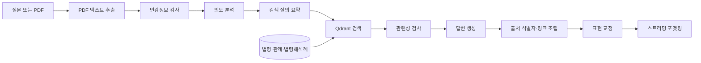

# AIGO-V2 — 임대차 계약 근거 제시형 RAG

[](https://github.com/bigmooon/aigo-youth/actions/workflows/ci.yml)


임대차 계약서와 관련 질문을 입력하면 법령·판례·법령해석례를 검색하고, 답변의 근거를 식별 가능한 출처와 함께 제시하는 프로젝트입니다.

기존 팀 프로젝트의 Q&A 챗봇을 개인 프로젝트로 이식한 뒤, **질문하지 않아도 계약서 전체에서 확인할 조항을 찾는 시스템**으로 확장하고 있습니다. 현재 저장소에는 RAG 기반 Q&A, PDF 텍스트 입력, 근거 인용, Streamlit UI와 기본 CI가 구현되어 있습니다.

> **법률 자문 고지**
>
> 본 프로젝트는 법률 자문이나 법적 판단을 제공하지 않습니다. 법령·판례·법령해석례를 바탕으로 정보를 안내하며, 구체적인 판단이 필요한 경우 전문가와 상담해야 합니다.

## 프로젝트의 출발점 — AIGO v1

AIGO-V2는 SK네트웍스 Family AI 캠프 24기 3차 팀 프로젝트 **“아이고~~ 청년!”**에서 시작했습니다. 당시에는 사용자가 특약이나 궁금한 상황을 직접 입력하면 법령·판례·법령해석례를 검색해 답하는 RAG 챗봇을 만들었습니다.

| v1 팀원 | GitHub |
|---|---|
| 임정희 | [bigmooon](https://github.com/bigmooon) |
| 정석원 | [JeongSW123](https://github.com/JeongSW123) |
| 고아라 | [Akoh-0909](https://github.com/Akoh-0909) |
| 김정현 | [Jeich-16](https://github.com/Jeich-16) |
| 진세형 | [gugu-eightyone](https://github.com/gugu-eightyone) |

### v1이 해결하려던 문제

부동산 임대차 계약은 보증금, 특약, 계약 기간처럼 확인해야 할 내용이 많지만 사회초년생과 일반 임차인이 이를 혼자 파악하기는 어렵습니다. v1은 어려운 법률 용어를 몰라도 자연어로 질문하고, 검색된 공식 문서를 근거로 답변과 출처 링크를 받을 수 있도록 설계했습니다.

- 특약 직접 입력 및 검토
- 임대차 상황에 관한 자연어 질의응답
- 법령·판례·법령해석례 기반 검색
- 개인정보가 포함된 질문 필터링
- 검색 근거와 원문 링크 제시

### v1 구현 화면


### v1에서 구축한 법률 데이터

법제처 국가법령정보센터의 법령·판례·법령해석례를 수집하고, 임대차 도메인 키워드로 선별한 뒤 검색 단위로 정제했습니다. 아래 수치는 **v1 팀 프로젝트 당시의 전처리 결과**이며 현재 v2의 성능 지표는 아닙니다.

| 데이터 | 수집 원본 | 정제·청킹 결과 | 청킹 전략 |
|---|---:|---:|---|
| 법령 | 1,707건 | 105,501 청크 | RecursiveCharacterTextSplitter 500/50 |
| 판례 | 1,717건 | 30,035 청크 | RecursiveCharacterTextSplitter 500/50 |
| 법령해석례 | 369건 | 3,864 청크 | RecursiveCharacterTextSplitter 400/60 |

전처리 과정에서는 문서 식별자와 날짜 등 검색·추적에 필요한 값은 메타데이터로 보존하고, 본문과 중복되거나 결측률이 높은 컬럼은 제외했습니다. 판례는 사건번호 결측, 중복 사건, 본문이 없는 문서를 제거했고 법령해석례는 중복 행을 제거했습니다.

### v1에서 확인한 개선 과제

1. 긴 질문을 그대로 검색하면 문서 유사도가 낮아지는 문제가 있었습니다. 이를 개선하기 위해 `query_summary` 노드를 추가해 검색용 핵심 질의를 분리했습니다.
2. 생성 답변만으로는 근거 문서의 직접 링크를 안정적으로 제공하기 어려웠습니다. `resolve_citations` 노드를 추가해 문서 메타데이터로 출처 링크를 조립했습니다.
3. PDF 업로드 UI는 있었지만 실제 문서 입력과 연결되지 않았습니다. v2에서 텍스트 기반 PDF 추출과 입력 흐름을 구현했습니다.

<details>
<summary><strong>v1 설계 산출물 보기</strong></summary>

#### 임베딩 모델 비교


#### 시스템 아키텍처


#### WBS


#### 요구사항 명세서


</details>

원본의 전체 조사·전처리 기록과 팀 회고는 [`aigo-ai` README](https://github.com/bigmooon/aigo-ai/blob/main/README.md)에서 확인할 수 있습니다.

## v1 → v2: 무엇이 달라졌나

| 구분 | v1 팀 프로젝트 | v2 개인 프로젝트 |
|---|---|---|
| 핵심 문제 | 사용자가 질문하면 근거 기반으로 답변 | 사용자가 질문을 만들기 전에 계약서에서 확인할 조항 발견 |
| 입력 | 특약·상황을 텍스트로 입력 | 텍스트 질문 + 계약서 PDF |
| 처리 | 질문 중심 RAG Q&A | 현재 Q&A, 향후 조항 분해·근거 매칭으로 확장 |
| 출력 | 대화형 답변과 참고 링크 | 현재 근거 기반 답변, 향후 조항별 발견 리포트 |
| 인용 | LLM 답변 이후 링크 보완 | 검색 메타데이터로 출처를 결정론적으로 조립 |
| 품질 검증 | 팀 테스트 시나리오와 실험 결과 | 기본 CI 구현, 골든셋·정량 평가는 로드맵 |
| 책임 범위 | 불리한 조항 안내 | 위험 등급을 단정하지 않고 검증 가능한 근거 제시 |
| 나의 확장 범위 | 팀원으로 공동 개발 | 문제 재정의, PDF 입력, 실행 환경, CI·평가 구조 재설계 |

v1은 “무엇을 물어볼지 아는 사용자”에게 유용했지만, 실제 임차인은 어떤 문구를 질문해야 하는지 모를 수 있습니다. 이 한계를 해결하기 위해 v2는 **질문에 답하는 챗봇에서 계약서 전체를 먼저 살펴보는 시스템**으로 방향을 바꿨습니다.

## 해결하려는 문제

임차인은 계약서에 어떤 위험이 숨어 있는지 알기 어렵기 때문에 질문 자체를 만들지 못할 수 있습니다. AIGO-V2는 단순히 질문에 답하는 것을 넘어 다음 흐름을 목표로 합니다.

```text
계약서 입력 → 조항 단위 분석 → 공식 근거 검색 → 확인할 내용과 근거 제시 → 후속 Q&A
```

시스템이 `위험·안전`을 단정하는 대신 다음과 같이 사용자가 검증할 수 있는 사실을 제시하는 것이 핵심 원칙입니다.

- 관련 법령 조문과의 차이
- 유사 문구가 다뤄진 판례·분쟁 사례
- 표준계약서 조항과의 차이
- 근거 문서의 식별자와 원문 링크

## 현재 구현 범위

| 영역 | 상태 | 설명 |
|---|:---:|---|
| 텍스트 Q&A | ✅ | 임대차 관련 질문을 LangGraph RAG 파이프라인으로 처리 |
| PDF 입력 | ✅ | 텍스트 기반 PDF에서 내용을 추출해 분석 입력으로 전달 |
| 개인정보 확인 | ✅ | 민감정보가 포함된 요청을 먼저 검사하고 필요 시 종료 |
| 의도·관련성 확인 | ✅ | 질문 의도와 검색 결과의 관련성을 확인해 무관한 답변을 억제 |
| 근거 인용 | ✅ | 생성 답변과 별도로 출처 식별자와 링크를 결정론적으로 조립 |
| 로컬·원격 Qdrant | ✅ | 로컬 파일 모드와 Qdrant Cloud 연결 지원 |
| 비통합 CI | ✅ | 외부 서비스 없이 실행 가능한 import·sanity 검사를 push와 PR에서 수행 |
| 조항 자동 분해·탐지 | 🚧 | 설계 및 구현 예정 |
| 골든셋 기반 P/R/F1 평가 | 🚧 | 평가 스키마와 구현 계획 수립 완료, 결과는 아직 미산출 |
| 이미지 PDF OCR | ⏳ | 현재 지원하지 않음 |

## 현재 사용자 흐름

1. 개인정보 수집·이용 고지에 동의합니다.
2. 임대차 관련 질문을 입력하거나 텍스트 기반 계약서 PDF를 첨부합니다.
3. 입력을 요약해 검색 질의로 변환하고 Qdrant에서 관련 문서를 찾습니다.
4. 관련성이 확인된 문서만 LLM에 전달합니다.
5. 답변과 함께 법령·판례·해석례의 출처를 표시합니다.

## 시스템 아키텍처



파이프라인 구현은 [`src/graph/pipeline.py`](src/graph/pipeline.py), UI 진입점은 [`src/ui/app.py`](src/ui/app.py)에서 확인할 수 있습니다.

## 주요 기술적 결정

### 판정보다 근거 제시

`위험·주의·안전`과 같은 등급은 사실관계와 해석에 따라 달라지고 법률 자문으로 오해될 수 있습니다. 그래서 현재와 향후 탐지 시스템 모두 결론보다 검증 가능한 근거를 먼저 제시하도록 설계했습니다.

### 긴 입력을 검색 질의로 분리

계약서나 긴 질문을 그대로 임베딩하면 검색 초점이 흐려질 수 있습니다. `query_summary` 노드가 핵심 요청을 검색용 질의로 정리하고 원문은 답변 문맥으로 유지합니다.

### 인용을 생성 답변과 분리

LLM이 출처 링크를 직접 만들게 하지 않고 `resolve_citations` 노드가 검색 문서의 메타데이터로 링크를 조립합니다. 이를 통해 존재하지 않는 URL이나 식별자가 출력되는 위험을 줄입니다.

### 로컬 실행과 외부 서비스 연결을 함께 지원

Qdrant는 기본적으로 로컬 파일 모드로 실행하며, 환경변수를 설정하면 Qdrant Cloud를 사용할 수 있습니다. LLM도 OpenAI 호환 엔드포인트를 받을 수 있도록 구성했습니다.

## 기술 스택

| 분류 | 기술 |
|---|---|
| Language | Python 3.12 |
| Agent workflow | LangGraph, LangChain |
| LLM | OpenAI-compatible chat model |
| Embedding | KURE-v1 기본 설정 |
| Vector database | Qdrant |
| PDF | pypdf, PyMuPDF |
| UI | Streamlit |
| Test & CI | pytest, GitHub Actions |

## 실행 방법

### 1. 요구사항

- Python 3.12 이상
- [uv](https://docs.astral.sh/uv/)
- OpenAI 호환 LLM API 키와 모델명
- 전체 법령 데이터를 다시 수집하려면 국가법령정보 Open API 키

### 2. 설치

```bash
git clone https://github.com/bigmooon/aigo-youth.git
cd aigo-youth

cp .env.example .env
uv sync
```

`.env`에서 최소한 다음 값을 설정합니다.

```dotenv
LLM_API_KEY=your-api-key
LLM_MODEL=gpt-4o-mini
LLM_BASE_URL=
QDRANT_PATH=./db
EMBEDDING_MODEL=nlpai-lab/KURE-v1
```

`LLM_BASE_URL`은 OpenAI 기본 엔드포인트를 사용할 때 비워둡니다.

### 3. 벡터스토어 준비

저장소에 포함된 판례 데이터 일부로 실행 환경을 준비할 수 있습니다.

```bash
# 데이터 파일 확인
uv run python scripts/build_vectorstore.py --dry-run

# 빠른 로컬 확인용: 최대 1,000개 청크 적재
uv run python scripts/build_vectorstore.py --limit 1000

# 포함된 전체 데이터 적재
uv run python scripts/build_vectorstore.py
```

법령·판례·법령해석례를 Open API에서 다시 수집하려면 `.env`의 `OC` 값을 설정한 뒤 다음 명령을 사용합니다.

```bash
uv run python scripts/sync_data.py
```

### 4. 애플리케이션 실행

```bash
uv run streamlit run src/ui/app.py
```

현재 PDF 입력은 텍스트가 포함된 PDF만 지원합니다. 스캔 이미지로 구성된 PDF에는 OCR이 필요합니다.

## 테스트

```bash
# CI와 같은 범위: 외부 LLM·벡터스토어가 필요 없는 테스트
uv run pytest -m "not integration" -v

# 실제 LLM과 벡터스토어를 사용하는 Q&A 스모크 테스트
uv run pytest -m integration -v
```

비통합 테스트는 모듈 import와 기본 실행 환경을 검증합니다. 이는 모델의 답변 정확도나 탐지 성능을 의미하지 않습니다. 모델 품질 수치는 골든셋과 평가 하네스가 구현된 뒤 별도로 공개할 예정입니다.

## 로드맵

- [x] v1 Q&A 파이프라인 및 데이터 구조 이식
- [x] PDF 텍스트 입력과 Streamlit UI
- [x] 비통합 CI 구성
- [ ] 계약서 조항 분해와 위험 카테고리 체계 확정
- [ ] 근거 ID를 포함한 파일럿 골든셋 30건 구축
- [ ] Retrieval hit@k, Precision, Recall, F1 평가
- [ ] 조항별 발견 유형 리포트 UI
- [ ] 라벨링 가이드와 평가 결과 공개
- [ ] 배포 및 사용자 피드백 수집

상세 설계는 [`docs/superpowers/specs/2026-07-06-aigo-v2-design.md`](docs/superpowers/specs/2026-07-06-aigo-v2-design.md), 구현 계획은 [`docs/superpowers/plans/2026-07-12-p0-p1-implementation.md`](docs/superpowers/plans/2026-07-12-p0-p1-implementation.md)에서 확인할 수 있습니다.

## License

[MIT License](LICENSE)
